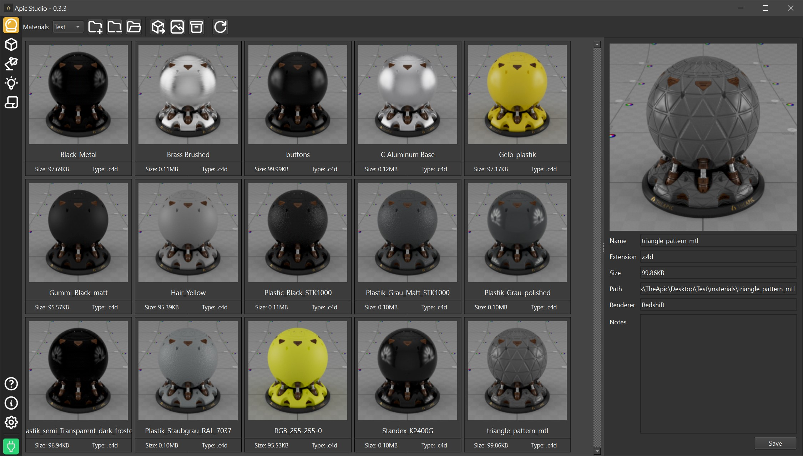
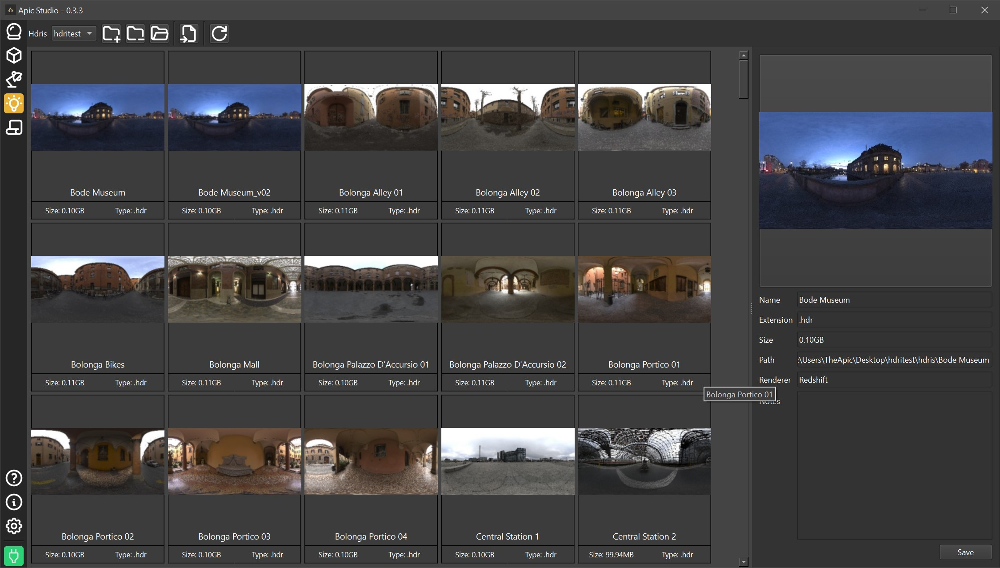

# Apic Studio

Apic Studio is a desktop asset management and preview tool tightly integrated with Maxon Cinema 4D.  
It provides structured pools for materials, models, HDRIs, and lightsets; supports preview rendering, backups, screenshots, and DCC communication to drive Cinema 4D operations (import/export, material previews, HDRI imports, etc.).




## Key Features

- Pool-based organization for **Materials**, **Models**, **HDRIs**, and **Lightsets**.
- Cinema 4D bridge for:
  - Importing/exporting models and materials.
  - Rendering material previews.
  - Loading HDRIs as dome/area lights.
- Visual asset browser with thumbnails and metadata.
- Backup system for versioned asset snapshots.
- Screenshot utility for capturing regions.
- Settings persistence per machine.
- SQLite-based pool database.
- UI built with **PySide6**.

## Requirements

- **Operating System**: Windows is the primary supported platform (Cinema 4D integration assumes Windows paths). Some functionality may degrade on other platforms.
- **Cinema 4D**: Installed (the latest installation under `C:\Program Files\Maxon Cinema 4D*` is autodetected).

## Installation / Setup

### Prebuild Version

1. Copy "apic_connector_main.pyp" to <Maxon Cinema 4D 20XX>/plugins/apic_connector
   or set the "g_additionalModulePath" Environment variable to the directory that contains the .pyp file.

2. Create a directory and copy the "apic_connector" and "shared" modules over.

3. Set C4DPYTHONPATH311 Environment variable to the created directory.

4. Run "Apic Studio.exe"

---

### Run from source

#### Requirements

- **Python 3.14**
- **rustup toolchain**
- **UV Package Manager**
- **Make** [Optional]

#### Installation

1. Clone repository

2. Run

```bash
Make run

[or]

uv run src/apic_studio.py
```

3. Build executable

```bash
make build

[or]

uv run build.py
```

## Future Improvements

- Cross-platform Cinema 4D detection enhancements.
- Improved error propagation to user dialogs.
- Asset tagging/filtering UI.
